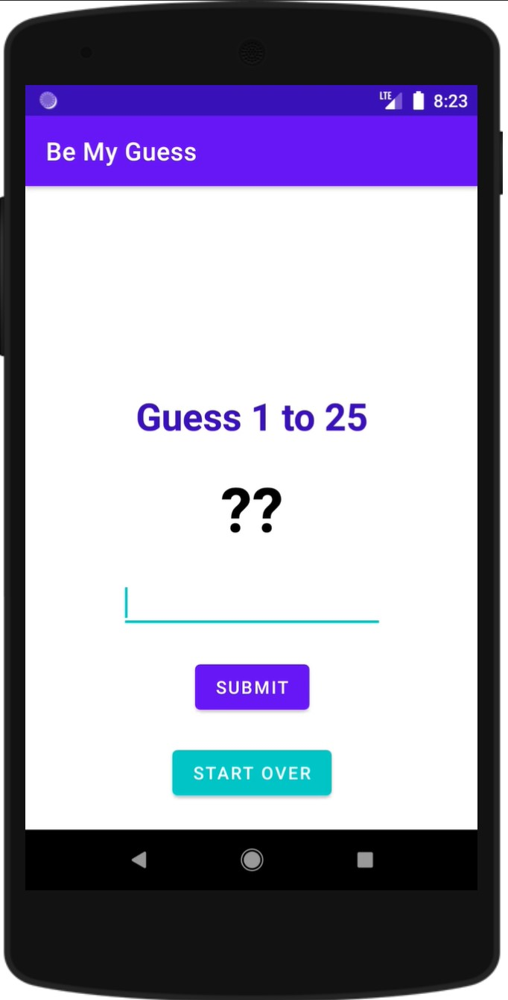
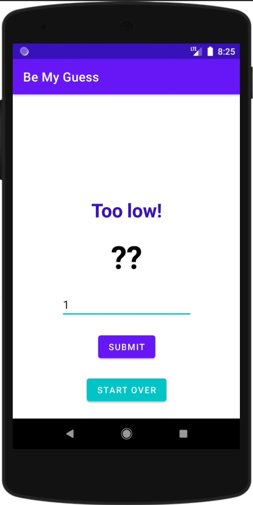
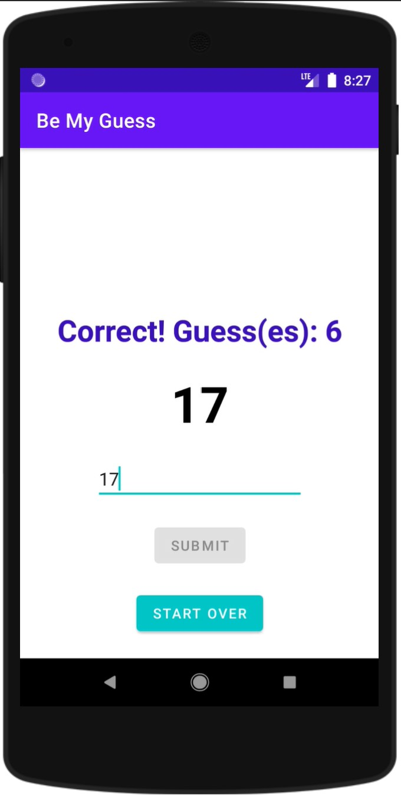

# Be My Guess - Android Number Guessing Game

A modern, intuitive number guessing game developed with Kotlin and Android Studio, demonstrating Android development best practices and clean architecture principles.

[](https://appetize.io/app/eqwdpwq956j1vqvbvu9zhvawaw)

## Overview

Be My Guess is a fun, interactive game where players try to guess a randomly generated number between 1 and 25. The app provides immediate feedback, guiding players toward the correct answer while tracking their attempts.

[Try the app live here!](https://appetize.io/app/eqwdpwq956j1vqvbvu9zhvawaw)

## Features

- Clean, intuitive user interface
- Real-time feedback on guesses
- Input validation and error handling
- Game state management
- Progress tracking
- One-touch game reset

## Technical Implementation

### Core Components

1. **Game Logic (`MainActivity.kt`)**
```kotlin
class MainActivity : AppCompatActivity() {
    var answer = 0
    var isGameOver = false
    var numOfAttempts = 0
    
    fun generateAnswer() {
        answer = Random.nextInt(1, 25)
    }
}
```

2. **Input Validation**
```kotlin
fun getUsersGuess() : Int? {
    val editTextGuess = findViewById<EditText>(R.id.editTextGuess)
    val usersGuess = editTextGuess.text.toString()
    
    return try {
        usersGuess.toInt()
    } catch (e: Exception) {
        null
    }
}
```

### Project Structure
```
.
├── MainActivity.kt           # Main game logic
├── activity_main.xml         # UI layout definition
├── app-debug.apk             # Debug build
└── demo/                     # Screenshots and demos
    ├── 0_activity_main_xml_design.jpg
    ├── 1_final_build.jpg
    └── ...
```

## Game Flow

1. App generates random number (1-25)
2. Player submits guess
3. App provides feedback:
   - "Too low!" if guess < answer
   - "Too high!" if guess > answer
   - "Correct!" if guess matches
4. Game tracks number of attempts
5. Player can start new game anytime

## Screenshots

<table>
  <tr>
    <td></td>
    <td></td>
    <td></td>
  </tr>
</table>

## Development Setup

1. Clone the repository:
```bash
git clone https://github.com/yourusername/be-my-guess.git
```

2. Open project in Android Studio

3. Build the app:
```bash
./gradlew assembleDebug
```

4. Install on device/emulator:
```bash
adb install app/build/outputs/apk/debug/app-debug.apk
```

## Technologies Used

- **Language**: Kotlin 1.5+
- **Build System**: Gradle
- **Min SDK**: Android 6.0 (API 23)
- **Target SDK**: Android 11 (API 30)

## Contributing

1. Fork the repository
2. Create feature branch (`git checkout -b feature/AmazingFeature`)
3. Commit changes (`git commit -m 'Add AmazingFeature'`)
4. Push to branch (`git push origin feature/AmazingFeature`)
5. Open a Pull Request

## License

Distributed under the MIT License. See `LICENSE` for more information.

## Acknowledgments

- Android Kotlin Fundamentals
- Material Design Guidelines
- [Appetize.io](https://appetize.io/) for app hosting
